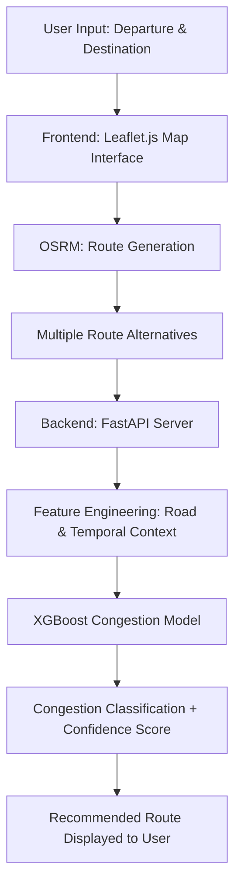

<div align="center">

# 🇹🇳 Tunisia AI Traffic Map

### AI-Powered Traffic Congestion Prediction & Route Optimization for Tunisia

**A machine learning system that predicts road congestion levels across all 24 Tunisian governorates and recommends optimized routes using geospatial intelligence and a custom-trained traffic model.**

[](https://YOUR_USERNAME.github.io/tunisia-traffic-map)
[](https://tunisia-ai-traffic-map.onrender.com)
[](LICENSE)


</div>

---

## 📌 Project Overview

**Tunisia AI Traffic Map** is an end-to-end machine learning system that predicts road congestion levels and recommends optimized routes across Tunisia. It combines geospatial data processing, road network analysis, traffic simulation, and gradient-boosted classification into a deployed, publicly accessible service.

Commercial navigation platforms such as Google Maps and Waze rely on massive volumes of proprietary, crowd-sourced GPS data to power their congestion models — data that is largely unavailable for a country like Tunisia. This project investigates a different approach: instead of depending on data that does not exist, it engineers a domain-specific dataset from open geospatial sources and a custom traffic simulation engine, then trains a supervised model on top of it.

The result is a system that produces congestion predictions and route recommendations for locations spanning all 24 Tunisian governorates, from dense urban centers to rural and remote road networks.

---

## 🚦 Problem Statement

Traffic prediction systems typically depend on large-scale, continuously updated data sources — historical GPS traces, live telemetry from millions of devices, and dense sensor networks. These prerequisites create a structural barrier for smaller markets:

- **Data scarcity** — Tunisia does not have the volume of real-time GPS or telemetry data that commercial platforms rely on.
- **Coverage gaps** — Existing tools concentrate prediction quality in major cities, with degraded or absent coverage in smaller towns and rural areas.
- **Local traffic behavior is underrepresented** — patterns specific to Tunisia (e.g. Friday prayer congestion, Ramadan evening traffic shifts) are not modeled by generic international systems.
- **Reliance on closed, proprietary platforms** — there is no open, regionally-focused alternative that can be inspected, extended, or adapted.

The core engineering challenge this project addresses is: *how do you build a credible traffic prediction system in a data-scarce environment, without access to the infrastructure that large commercial players use?*

---

## 💡 Solution Overview

The system is built around three coordinated components:

1. **Road network extraction** — OpenStreetMap data is processed via OSMnx to construct a structured graph of Tunisia's road network, capturing road classification, lane counts, and geometry.
2. **Synthetic traffic generation** — A custom simulation engine generates realistic congestion scenarios by combining road characteristics with temporal context (peak hours, weekday/weekend patterns, and known local behavioral shifts).
3. **Supervised congestion classification** — An XGBoost model is trained on the engineered dataset to classify congestion into three levels and is served through a FastAPI backend for real-time inference.

At request time, the frontend retrieves candidate routes from OSRM, extracts features for each one, sends them to the prediction API, and surfaces the route with the lowest predicted congestion level to the user.

---

## ✨ Key Features

🗺️ **Interactive Map Interface**
A responsive Leaflet.js-based map that lets users search locations and visualize candidate routes across Tunisia.

🔍 **Tunisia-Focused Location Search**
Geocoding and location search tuned for Tunisian cities, towns, and remote areas via Photon.

🛣️ **Multi-Route Analysis**
Multiple route alternatives are retrieved per query and evaluated independently rather than scored as a single path.

🤖 **AI-Based Congestion Prediction**
Each candidate route is classified by the trained model into one of three congestion levels:
- 🟢 Low congestion
- 🟡 Medium congestion
- 🔴 High congestion

🇹🇳 **Local Traffic Intelligence**
The model incorporates traffic behaviors specific to Tunisia, including peak commuting hours, Friday prayer congestion patterns, Ramadan evening traffic variation, and regional road characteristics.

⚡ **Real-Time Route Recommendation**
The system automatically surfaces the route with the lowest predicted congestion level, with an associated confidence score.

---

## 🧠 System Workflow



---

## 🔬 Machine Learning Pipeline

**Data Sources**
Road network geometry and attributes are extracted from OpenStreetMap using OSMnx, covering all 24 Tunisian governorates. Since real-world traffic telemetry is not available at scale, training data is produced through a custom simulation engine rather than sourced from live GPS feeds.

**Data Generation & Preprocessing**
The simulation engine generates congestion labels by combining road-level attributes with temporal traffic context, producing a labeled dataset large enough for robust supervised training (8.5M+ samples).

**Feature Engineering**
Features are derived from both static road characteristics and time-dependent context:
- Road classification and lane count
- Road width and geometric attributes
- Geographic/regional context
- Temporal indicators (hour of day, day of week, local events such as Friday prayers and Ramadan)
- A custom **Congestion Pressure Index (CPI)** combining multiple road attributes into a single predictive signal

**Model Selection**
XGBoost was selected over alternatives (e.g. logistic regression, random forest, neural networks) because it handles heterogeneous tabular features effectively, trains efficiently at multi-million-row scale, and produces a compact model artifact suitable for lightweight API deployment — a meaningful constraint on free-tier hosting infrastructure.

**Training Process**
The model was trained in a Google Colab environment on the full generated dataset, with evaluation performed on a held-out split to assess generalization across congestion classes.

**Evaluation**
Performance was measured using accuracy, F1 score, and per-class precision/recall to ensure the model performs reliably across all three congestion levels, not just the majority class.

**Deployment**
The trained model is serialized and served through a FastAPI backend, exposing a prediction endpoint consumed by the frontend at request time.

---

## 📊 Model Performance

| Metric | Result | What it means |
|---|---:|---|
| Training samples | 8,529,663 | Scale of the simulation-generated dataset used for training |
| Geographic coverage | 24 Tunisian governorates | Full national coverage, not limited to major cities |
| Model type | XGBoost Classifier | Gradient-boosted decision trees for multi-class congestion prediction |
| Accuracy | 84.92% | Proportion of correctly classified congestion levels overall |
| F1 Score | 84.96% | Balanced measure of precision and recall across classes |
| High congestion precision | 96% | Of routes predicted as high congestion, 96% were correct — important for avoiding false alarms |
| Low congestion recall | 93% | 93% of genuinely low-congestion routes were correctly identified |
| Model size | 8.37 MB | Compact enough for fast loading on free-tier API hosting |

---

## 🏗️ Technical Architecture

```
                         User Interface
                              │
                              ▼
                    ┌─────────────────┐
                    │   Leaflet.js    │
                    │ Interactive Map │
                    └─────────────────┘
                              │
                              ▼
                    ┌─────────────────┐
                    │      OSRM       │
                    │  Route Engine   │
                    └─────────────────┘
                              │
                              ▼
                     Route Alternatives
                              │
                              ▼
                 ┌─────────────────────┐
                 │ Feature Engineering │
                 └─────────────────────┘
                              │
                              ▼
                 ┌─────────────────────┐
                 │      FastAPI        │
                 │  Prediction Server  │
                 └─────────────────────┘
                              │
                              ▼
                 ┌─────────────────────┐
                 │  XGBoost ML Model   │
                 └─────────────────────┘
                              │
                              ▼
                   Congestion Prediction
```

**Frontend**
- Leaflet.js for interactive mapping, OpenStreetMap tiles, and Photon-based geocoding
- Vanilla JavaScript for client-side route requests and UI state
- Responsible for user interaction, map rendering, and displaying recommended routes

**Backend**
- FastAPI serves the trained XGBoost model behind a REST endpoint
- Handles feature construction from raw route/road data before inference
- Stateless request/response design suited to free-tier cloud hosting

**Machine Learning**
- Training pipeline: OSMnx extraction → simulation-based labeling → feature engineering → XGBoost training in Google Colab
- Inference pipeline: route features assembled per request → model prediction → congestion class + confidence score returned

**Deployment**
- Frontend hosted on GitHub Pages
- Backend API hosted on Render
- Model training performed in Google Colab

---

## 🧩 Engineering Challenges & Solutions

| Challenge | Technical Solution |
|---|---|
| No large-scale real traffic dataset available for Tunisia | Built a custom simulation engine that generates congestion scenarios from road attributes and temporal context, converting a data-availability gap into a data-engineering problem |
| Modeling congestion without live GPS feeds | Engineered a composite **Congestion Pressure Index (CPI)** from road classification, lane count, and geometry as a proxy signal for traffic pressure |
| National-scale geographic complexity (24 governorates, urban to rural) | Built a geospatial processing pipeline on OSMnx capable of extracting and normalizing road network data uniformly across regions of varying density |
| Deploying an ML model without dedicated inference infrastructure | Designed a lightweight FastAPI service around a compact (8.37 MB) model artifact, enabling deployment on free-tier hosting (Render) |
| Capturing region-specific temporal patterns (e.g. Friday prayers, Ramadan) | Added explicit temporal/event features to the training data rather than relying on generic hour-of-day signals alone |

---

## 🛠️ Technology Stack

**Frontend**

| Technology | Purpose |
|---|---|
| JavaScript | Client-side logic |
| Leaflet.js | Interactive mapping |
| OpenStreetMap | Base map data |
| Photon | Geocoding |
| HTML / CSS | User interface |

**Backend**

| Technology | Purpose |
|---|---|
| Python | Data processing & ML pipeline |
| FastAPI | REST API for model serving |
| OSRM | Route generation engine |

**AI / ML**

| Technology | Purpose |
|---|---|
| XGBoost | Congestion classification model |
| OSMnx | Road network extraction |

**Data Processing**

| Technology | Purpose |
|---|---|
| Pandas | Tabular data processing |
| NumPy | Numerical computation |

**Deployment**

| Platform | Usage |
|---|---|
| GitHub Pages | Frontend hosting |
| Render | Backend API hosting |
| Google Colab | Model training environment |

---

## 📂 Project Structure

```
tunisia-traffic-map/
├── frontend/
│   ├── index.html
│   ├── style.css
│   └── app.js
│
├── backend/
│   ├── main.py
│   ├── requirements.txt
│   ├── tunisia_model.pkl
│   └── model_metadata.json
│
└── README.md
```

---

## ⚙️ Installation & Running Instructions

### Prerequisites
- Python 3.9+
- Node.js (optional, for local frontend serving)
- pip

### Backend Setup

```bash
git clone https://github.com/YOUR_USERNAME/tunisia-traffic-map.git
cd tunisia-traffic-map/backend

python -m venv venv
source venv/bin/activate      # Windows: venv\Scripts\activate

pip install -r requirements.txt
uvicorn main:app --reload
```

The API will be available at `http://localhost:8000`.

### Frontend Setup

```bash
cd ../frontend
# Serve with any static file server, e.g.:
python -m http.server 5500
```

Then open `http://localhost:5500` in your browser.

### API Usage Example

```bash
curl -X POST "https://tunisia-ai-traffic-map.onrender.com/predict" \
  -H "Content-Type: application/json" \
  -d '{
        "road_class": "primary",
        "lanes": 2,
        "hour": 18,
        "day_of_week": "friday"
      }'
```

Example response:

```json
{
  "congestion_level": "high",
  "confidence": 0.91
}
```

---

## 🚀 Future Roadmap

**Current limitations**
- [ ] Training data is simulation-based rather than derived from real-world GPS traces
- [ ] No live weather or road-event integration yet

**Planned improvements**
- [ ] Integrate real GPS traffic traces where available
- [ ] Add live weather conditions as a model input
- [ ] Add real-time accident and road event detection
- [ ] Continuously retrain the model as new data becomes available

**Research directions**
- [ ] Explore Graph Neural Networks for route-level congestion prediction
- [ ] Extend geographic coverage to neighboring North African countries

---

## 👤 Author

**Mohamed Bensaad**

Computer Science Engineering Student @ ENICarthage
Focus: AI Engineering, Machine Learning, Generative AI

Interested in:
- Machine Learning Systems
- Generative AI
- Intelligent Transportation Systems
- Real-world AI applications

[LinkedIn](#) · [GitHub](#) · [Portfolio](#)

---

<div align="center">

⭐ If you find this project interesting, consider giving it a star.

**Built with ❤️ for Tunisia 🇹🇳**

</div>
